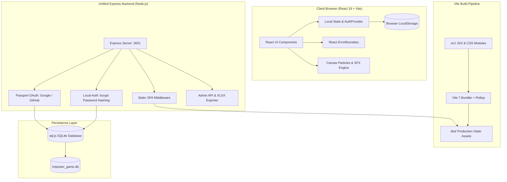

# 🎮 IMPOSTER — Who is Among Us?

> **The Ultimate Social Deduction Party Game for 3–10 Players**  
> Pass the device, discover your secret role, bluff your way through interrogation, and vote out the hidden imposter!

[](https://nodejs.org/)
[](https://vite.dev/)
[](https://react.dev/)
[](https://vitest.dev/)
[](LICENSE)

---

## 📑 Table of Contents

- [Overview](#-overview)
- [System & Build Architecture](#-system--build-architecture)
  - [Architecture Flow Diagram](#architecture-flow-diagram)
  - [Dual Runtime Architecture](#dual-runtime-architecture)
- [Tech Stack](#-tech-stack)
- [Project Directory Structure](#-project-directory-structure)
- [Prerequisites](#-prerequisites)
- [Installation & Setup](#-installation--setup)
- [Running the Project](#-running-the-project)
  - [Development Mode (With Vite HMR)](#1-development-mode-frontend--backend-with-hmr)
  - [Unified Production Mode (Single Port 3001)](#2-unified-production-mode-full-stack-on-port-3001)
- [Testing Suite ("All Kinds of Tests")](#-testing-suite-all-kinds-of-tests)
  - [Test Tiers & Coverage](#test-tiers--coverage)
  - [Executing Tests](#executing-tests)
- [Code Quality & Linting](#-code-quality--linting)
- [API Reference](#-api-reference)
- [License & Contributions](#-license)

---

## 🌟 Overview

**IMPOSTER** is a fast-paced social deduction web game crafted with rich cyberpunk aesthetics, animated character poses, dynamic particles, and offline-first gameplay. Designed for friends, parties, and family gatherings:

- **Pass & Play Device Security**: Safe privacy shield overlays so only the active player sees their role card.
- **17+ Categorized Word Banks (400+ Words)**: Spans Video Games, Sports, Tamil/Telugu/Malayalam/Hindi/English Cinema, Anime, Food, Animals, and custom user-provided words.
- **Contextual Imposter Hints**: Optional smart clues that give the imposter subtle hints (category clue, first letter, word length) to keep rounds intensely competitive.
- **Timer-Backed Discussion & Voting**: Structured discussion phase, suspect interrogation, and visual vote confirmation.
- **Seamless Round Resets**: "Next Round — Same Players" retains team names and scores while rotating the imposter and choosing fresh secret words.
- **Offline + Full-Stack Ready**: Plays 100% offline via browser local storage, while offering an optional Express + SQLite backend for user accounts, Passport OAuth, and Excel exports.

---

## 🏗 System & Build Architecture

### Architecture Flow Diagram



### Dual Runtime Architecture

The project supports two distinct execution topologies:

1. **Development Environment (Decoupled HMR)**:
   - **Frontend**: Vite development server runs on `http://localhost:5173` with instant Hot Module Replacement (HMR) and CSS module updates.
   - **Backend**: Express API server runs concurrently on `http://localhost:3001`, handling authentication sessions, database queries, and OAuth callbacks with CORS enabled for `localhost:5173`.

2. **Production Environment (Unified Full-Stack)**:
   - Vite compiles and tree-shakes all React code into static assets inside `/dist`.
   - The Express server detects `/dist` and serves both the single-page application (SPA fallback) and all `/api/*` endpoints on a single port (`http://localhost:3001`). No separate web server (like Nginx) is required for deployment.

---

## 💻 Tech Stack

| Domain | Technology | Description |
| --- | --- | --- |
| **Frontend Framework** | **React 19** | Component-driven UI with state hooks, context, and error boundaries |
| **Build Tool** | **Vite 7** | Sub-second cold starts, Rollup-based production minification |
| **Styling** | **CSS Modules (Vanilla CSS)** | Scoped, zero-runtime overhead cyberpunk neon theme |
| **Testing Engine** | **Vitest 5 + Testing Library** | Vite-native unit, component, and integration test suite with jsdom |
| **Backend Server** | **Express 4 (Node.js)** | RESTful API, session handling, and static bundle delivery |
| **Authentication** | **Passport.js & bcryptjs** | Google & GitHub OAuth strategies + local password registration |
| **Database** | **sql.js (SQLite Pure JS)** | Zero-native dependency SQLite database with atomic disk persistence |
| **Export Utility** | **SheetJS (xlsx)** | Automated admin export of player leaderboards to Excel |
| **Linting** | **ESLint 9** | Modern Flat Configuration enforcing strict clean code standards |

---

## 📂 Project Directory Structure

```text
imposter-game/
├── index.html                      # HTML5 entry template with viewport & mobile meta tags
├── package.json                    # Root manifest (Vite, React 19, Vitest, Testing Library)
├── vite.config.js                  # Vite configuration & Vitest jsdom test environment
├── eslint.config.js                # ESLint 9 flat configuration for frontend and backend
├── .gitignore                      # Git ignore patterns (.DS_Store, .vscode, node_modules, dist)
│
├── dist/                           # Compiled production static bundle (HTML, CSS, JS)
│
├── public/                         # Static icons and assets served directly
│   └── amongUS/                    # App icons and responsive favicon images
│
├── src/                            # Frontend source code
│   ├── main.jsx                    # React DOM root entry point
│   ├── App.jsx                     # Root application coordinator with Auth & ErrorBoundary
│   │
│   ├── test/
│   │   └── setup.js                # Global Vitest configuration & jest-dom setup
│   │
│   ├── __tests__/                  # Frontend automated test suites
│   │   ├── gameEngine.test.js      # Unit tests: Categories, word generation, hint logic
│   │   ├── authContext.test.jsx    # Integration tests: AuthProvider, login, score tracking
│   │   └── components.test.jsx     # Component tests: App, LoginScreen, ErrorBoundary, Rules
│   │
│   ├── components/
│   │   ├── ErrorBoundary.jsx       # Graceful crash handling component
│   │   │
│   │   ├── Auth/                   # Authentication & player profile components
│   │   │   ├── AuthContext.js      # React Context interface
│   │   │   ├── AuthProvider.jsx    # Offline-first localStorage identity & score state
│   │   │   ├── LoginScreen.jsx     # Cyberpunk player identity gateway
│   │   │   ├── LoginScreen.module.css
│   │   │   └── useAuth.js          # Custom consumer hook
│   │   │
│   │   └── ImposterGame/           # Core Social Deduction Game Module
│   │       ├── ImposterGame.jsx    # Master game controller (State machine: Setup -> Vote -> Result)
│   │       ├── ImposterGame.module.css # Cyberpunk animations, neon glows, responsive layouts
│   │       ├── HomeScreen.jsx      # Lobby, round stats, player roster, quick-start controls
│   │       ├── HomeScreen.module.css
│   │       ├── GameCharacter.jsx   # Dynamic animated avatar with state poses
│   │       ├── GameCharacter.module.css
│   │       ├── Confetti.jsx        # Canvas-based celebratory particle fireworks
│   │       ├── InstructionManual.jsx # Interactive rulebook overlay
│   │       ├── ParticleBackground.jsx# Ambient interactive canvas particle background
│   │       └── constants.js        # 17 category word banks, hints, role randomization
│   │
│   └── styles/
│       ├── globals.css             # CSS reset & base styling variables
│       └── index.css               # Typography & global animations
│
└── server/                         # Backend Express server & database
    ├── index.js                    # Express application, routes, and static SPA hosting
    ├── db.js                       # SQLite database engine via sql.js with bcrypt auth
    ├── imposter_game.db            # Persistent SQLite database file
    ├── package.json                # Server-specific dependencies (Express, Passport, SQLite)
    ├── .env.example                # Sample environment variables for OAuth and session secrets
    │
    └── __tests__/                  # Backend automated test suites
        ├── db.test.js              # Unit tests: SQLite CRUD, bcrypt, OAuth upsert, sanitization
        └── api.test.js             # Integration tests: Health check, auth APIs, admin endpoints
```

---

## 📋 Prerequisites

Before running the project, ensure you have the following installed:

- **Node.js**: `v18.0.0` or higher (`v20+ LTS` strongly recommended) — verify via `node -v`
- **npm**: `v9.0.0` or higher — verify via `npm -v`
- **Git**: For cloning the repository

---

## 🚀 Installation & Setup

### 1. Clone the Repository

Note that the project resides within the repository workspace. Navigate into the application directory:

```bash
git clone https://github.com/SURYA16-T/Imposter-Game.git
cd Imposter-Game/imposter-game
```

### 2. Install Dependencies

Install root frontend & test dependencies:

```bash
npm install
```

Install backend dependencies:

```bash
cd server
npm install
cd ..
```

### 3. Environment Variables (Optional)

The backend operates with automatic fallbacks for local and offline testing. To configure custom session secrets or production OAuth credentials:

```bash
cp server/.env.example server/.env
```

---

## 🎯 Running the Project

### 1. Development Mode (Frontend + Backend with HMR)

Run the client with hot reload and the backend in watch mode:

**Terminal 1 (Frontend Vite Server):**

```bash
npm run dev
```

> Access client at: **`http://localhost:5173`**

**Terminal 2 (Backend Express Server):**

```bash
cd server
npm run dev
```

> Backend running at: **`http://localhost:3001`**

---

### 2. Unified Production Mode (Full-Stack on Port 3001)

Build the frontend bundle and serve the entire application from the unified Express backend on a single port:

```bash
# Step 1: Build the production bundle
npm run build

# Step 2: Start the unified server
cd server
npm start
```

> Open your browser at: **`http://localhost:3001`**  
> The Express server serves both the production React bundle and all `/api/*` routes simultaneously.

---

## 🧪 Testing Suite ("All Kinds of Tests")

The project includes an end-to-end automated testing suite powered by **Vitest**, **React Testing Library**, **jsdom**, and **Supertest**.

### Test Tiers & Coverage

1. **Game Engine & Constants Unit Tests** (`src/__tests__/gameEngine.test.js`):
   - Validates all 17 categories have complete word lists and descriptive hints.
   - Tests cryptographically secure pseudo-randomness within safe bounds.
   - Validates hint generation for regular words, object words, and fallback strings.
   - Tests role assignment, custom word sets, and imposter alternation across rounds.

2. **Database & Authentication Unit Tests** (`server/__tests__/db.test.js`):
   - Tests SQLite in-memory table creation and schema migrations.
   - Tests username uniqueness and case-insensitive matching.
   - Verifies `bcrypt` password hashing and credential validation.
   - Tests player data sanitization (ensuring `password_hash` is never exposed).
   - Tests OAuth profile creation and last-login tracking.

3. **Backend API Integration Tests** (`server/__tests__/api.test.js`):
   - Tests `GET /api/health` system availability.
   - Tests `GET /api/auth/check-username` validation logic.
   - Tests `POST /api/auth/register` and `POST /api/auth/login` session management.
   - Tests `GET /api/me` session validation.
   - Tests `GET /api/admin/users` management endpoints.

4. **Frontend State & Storage Integration Tests** (`src/__tests__/authContext.test.jsx`):
   - Tests `AuthProvider` state initialization and `localStorage` persistence.
   - Tests player login, logout, score recording, and score resets.

5. **React Component & Smoke Tests** (`src/__tests__/components.test.jsx`):
   - Tests `App` authentication routing.
   - Tests `ErrorBoundary` rendering and error recovery without white-screens.
   - Tests `LoginScreen` user input validation and button actions.
   - Tests `InstructionManual` modal rendering and dismiss handlers.

### Executing Tests

Run the complete test suite once:

```bash
npm test
```

Run tests in interactive watch mode during development:

```bash
npm run test:watch
```

---

## 🔍 Code Quality & Linting

Verify code quality across both `src/` (frontend) and `server/` (backend) using ESLint 9:

```bash
npm run lint
```

Verify that the production build compiles cleanly:

```bash
npm run build
```

---

## 📡 API Reference

| Method | Endpoint | Description | Auth Required |
| --- | --- | --- | --- |
| `GET` | `/api/health` | Health check endpoint returning server status and timestamp | No |
| `GET` | `/api/auth/check-username` | Checks if a requested username is available (`?username=...`) | No |
| `POST` | `/api/auth/register` | Registers a new account with `{ username, password, email }` | No |
| `POST` | `/api/auth/login` | Authenticates a user with `{ username, password }` | No |
| `GET` | `/api/me` | Returns sanitized profile for currently authenticated session | Yes |
| `POST` | `/api/logout` | Terminates active session and clears authentication cookies | Yes |
| `GET` | `/auth/google` | Initiates Google OAuth flow (or local fallback in dev) | No |
| `GET` | `/auth/github` | Initiates GitHub OAuth flow (or local fallback in dev) | No |
| `GET` | `/api/admin/users` | Lists all registered players (sanitized) | Admin |
| `GET` | `/api/admin/export` | Generates and downloads Excel spreadsheet (`.xlsx`) of players | Admin |

---

## 📄 License

This project is licensed under the **MIT License**. See the [LICENSE](LICENSE) file for details.
